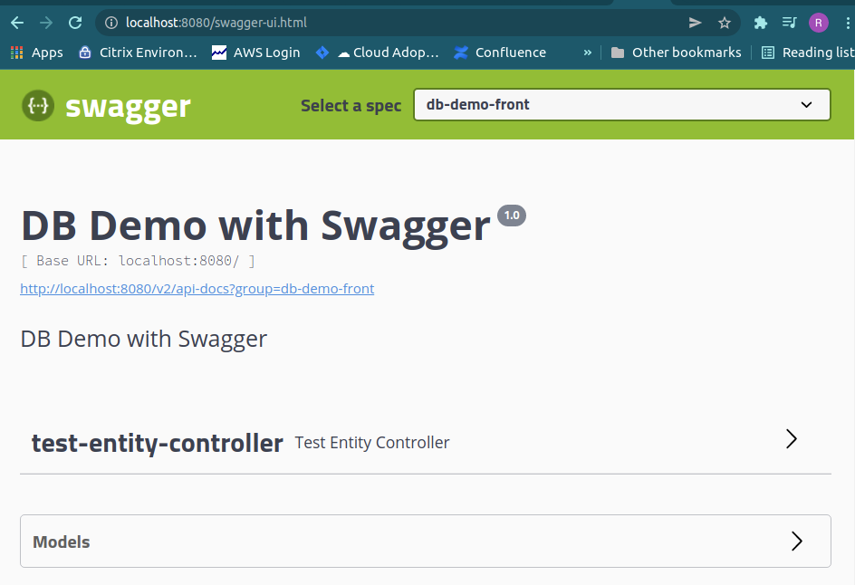

# How did I build and deploy the SRE Challenge apps

## Gradle build all apps in Docker

`docker build -t sre-challenge-all-apps .`

## Build Spring Boot uServices with customized application.yaml
`docker build -t popye/sre-challenge-back-app:0.1.0   -f app/back/src/main/docker/Dockerfile app/back/src/main/resources`
`docker build -t popye/sre-challenge-front-app:0.1.0  -f app/front/src/main/docker/Dockerfile app/front/src/main/resources`
`docker build -t popye/sre-challenge-reader-app:0.1.0 -f app/reader/src/main/docker/Dockerfile app/reader/src/main/resources`

## Push images to Docker Hub

### Login to Docker Hub

`docker login -u <--docker hub username-->`

### Push Images
`docker push popye/sre-challenge-back-app:0.1.0`
`docker push popye/sre-challenge-front-app:0.1.0`
`docker push popye/sre-challenge-reader-app:0.1.0`

## Create desired namespaces
`kubectl apply -f namespaces.yaml`

## Deploy Postgres
`helm install -n postgres sre-challenge-pg bitnami/postgresql -f postgres/values-custom.yaml`

## Deploy Kafka
`helm install -n kafka sre-challenge-kafka bitnami/kafka -f kafka/values-custom.yaml`

## Deploy Back App
`helm install -n demo-back back-app helm/back-app/`

## Deploy Front App
`helm install -n demo-front front-app helm/front-app/`

## Deploy Reader App
`helm install -n demo-reader reader-app helm/reader-app/`


# helm list

```
$ helm list -A 
    NAME               	NAMESPACE  	REVISION	UPDATED                                	STATUS  	CHART              	APP VERSION
    back-app           	demo-back  	1       	2021-12-07 10:00:03.155033091 +0100 CET	deployed	back-app-0.1.0     	0.1.0      
    front-app          	demo-front 	1       	2021-12-07 10:00:28.450375164 +0100 CET	deployed	front-app-0.1.0    	0.1.0      
    reader-app         	demo-reader	1       	2021-12-07 10:00:41.647297141 +0100 CET	deployed	reader-app-0.1.0   	0.1.0      
    sre-challenge-kafka	kafka      	1       	2021-12-07 09:55:01.149892152 +0100 CET	deployed	kafka-14.4.3       	2.8.1      
    sre-challenge-pg   	postgres   	1       	2021-12-07 09:55:10.60995216 +0100 CET 	deployed	postgresql-10.13.11	11.14.0
```

# kubectl get all 

## back-app

```
$ kubectl -n demo-back get all -o wide
NAME                            READY   STATUS    RESTARTS   AGE     IP           NODE       NOMINATED NODE   READINESS GATES
pod/back-app-7dc8895fcb-dw6rh   1/1     Running   0          6m19s   172.17.0.8   minikube              

NAME               TYPE        CLUSTER-IP     EXTERNAL-IP   PORT(S)    AGE     SELECTOR
service/back-app   ClusterIP   10.111.87.60           8080/TCP   6m19s   app.kubernetes.io/instance=back-app,app.kubernetes.io/name=back-app

NAME                       READY   UP-TO-DATE   AVAILABLE   AGE     CONTAINERS   IMAGES                               SELECTOR
deployment.apps/back-app   1/1     1            1           6m19s   back-app     popye/sre-challenge-back-app:0.1.1   app.kubernetes.io/instance=back-app,app.kubernetes.io/name=back-app

NAME                                  DESIRED   CURRENT   READY   AGE     CONTAINERS   IMAGES                               SELECTOR
replicaset.apps/back-app-7dc8895fcb   1         1         1       6m19s   back-app     popye/sre-challenge-back-app:0.1.1   app.kubernetes.io/instance=back-app,app.kubernetes.io/name=back-app,pod-template-hash=7dc8895fcb
```

## front-app

```
$ kubectl -n demo-front get all -o wide
NAME                             READY   STATUS    RESTARTS   AGE    IP           NODE       NOMINATED NODE   READINESS GATES
pod/front-app-5f68bc4889-bxlv6   1/1     Running   0          6m1s   172.17.0.9   minikube              

NAME                TYPE        CLUSTER-IP     EXTERNAL-IP   PORT(S)    AGE    SELECTOR
service/front-app   ClusterIP   10.96.253.67           8080/TCP   6m1s   app.kubernetes.io/instance=front-app,app.kubernetes.io/name=front-app

NAME                        READY   UP-TO-DATE   AVAILABLE   AGE    CONTAINERS   IMAGES                                SELECTOR
deployment.apps/front-app   1/1     1            1           6m1s   front-app    popye/sre-challenge-front-app:0.1.0   app.kubernetes.io/instance=front-app,app.kubernetes.io/name=front-app

NAME                                   DESIRED   CURRENT   READY   AGE    CONTAINERS   IMAGES                                SELECTOR
replicaset.apps/front-app-5f68bc4889   1         1         1       6m1s   front-app    popye/sre-challenge-front-app:0.1.0   app.kubernetes.io/instance=front-app,app.kubernetes.io/name=front-app,pod-template-hash=5f68bc4889
```

## reader-app

```
$ kubectl -n demo-reader get all -o wide
NAME                              READY   STATUS    RESTARTS   AGE     IP            NODE       NOMINATED NODE   READINESS GATES
pod/reader-app-67b4cf6d95-sf7sc   1/1     Running   0          5m56s   172.17.0.10   minikube              

NAME                 TYPE        CLUSTER-IP       EXTERNAL-IP   PORT(S)    AGE     SELECTOR
service/reader-app   ClusterIP   10.109.192.155           8080/TCP   5m56s   app.kubernetes.io/instance=reader-app,app.kubernetes.io/name=reader-app

NAME                         READY   UP-TO-DATE   AVAILABLE   AGE     CONTAINERS   IMAGES                                 SELECTOR
deployment.apps/reader-app   1/1     1            1           5m56s   reader-app   popye/sre-challenge-reader-app:0.1.0   app.kubernetes.io/instance=reader-app,app.kubernetes.io/name=reader-app

NAME                                    DESIRED   CURRENT   READY   AGE     CONTAINERS   IMAGES                                 SELECTOR
replicaset.apps/reader-app-67b4cf6d95   1         1         1       5m56s   reader-app   popye/sre-challenge-reader-app:0.1.0   app.kubernetes.io/instance=reader-app,app.kubernetes.io/name=reader-app,pod-template-hash=67b4cf6d95
```

## postgres

```
$ kubectl -n postgres get all -o wide
NAME                     READY   STATUS    RESTARTS   AGE   IP           NODE       NOMINATED NODE   READINESS GATES
pod/sre-challenge-pg-0   1/1     Running   0          11m   172.17.0.7   minikube              

NAME                                TYPE        CLUSTER-IP       EXTERNAL-IP   PORT(S)    AGE   SELECTOR
service/sre-challenge-pg            ClusterIP   10.100.223.230           5432/TCP   11m   app.kubernetes.io/instance=sre-challenge-pg,app.kubernetes.io/name=sre-challenge-pg,role=primary
service/sre-challenge-pg-headless   ClusterIP   None                     5432/TCP   11m   app.kubernetes.io/instance=sre-challenge-pg,app.kubernetes.io/name=sre-challenge-pg

NAME                                READY   AGE   CONTAINERS         IMAGES
statefulset.apps/sre-challenge-pg   1/1     11m   sre-challenge-pg   docker.io/bitnami/postgresql:11.5.0-debian-9-r90
```

## kafka

```
$ kubectl -n kafka get all -o wide
NAME                                  READY   STATUS    RESTARTS      AGE   IP           NODE       NOMINATED NODE   READINESS GATES
pod/sre-challenge-kafka-0             1/1     Running   3 (10m ago)   12m   172.17.0.3   minikube              
pod/sre-challenge-kafka-zookeeper-0   1/1     Running   0             12m   172.17.0.4   minikube              

NAME                                             TYPE        CLUSTER-IP       EXTERNAL-IP   PORT(S)                      AGE   SELECTOR
service/sre-challenge-kafka                      ClusterIP   10.98.203.165            9092/TCP                     12m   app.kubernetes.io/component=kafka,app.kubernetes.io/instance=sre-challenge-kafka,app.kubernetes.io/name=sre-challenge-kafka
service/sre-challenge-kafka-headless             ClusterIP   None                     9092/TCP,9093/TCP            12m   app.kubernetes.io/component=kafka,app.kubernetes.io/instance=sre-challenge-kafka,app.kubernetes.io/name=sre-challenge-kafka
service/sre-challenge-kafka-zookeeper            ClusterIP   10.109.124.219           2181/TCP,2888/TCP,3888/TCP   12m   app.kubernetes.io/component=zookeeper,app.kubernetes.io/instance=sre-challenge-kafka,app.kubernetes.io/name=zookeeper
service/sre-challenge-kafka-zookeeper-headless   ClusterIP   None                     2181/TCP,2888/TCP,3888/TCP   12m   app.kubernetes.io/component=zookeeper,app.kubernetes.io/instance=sre-challenge-kafka,app.kubernetes.io/name=zookeeper

NAME                                             READY   AGE   CONTAINERS   IMAGES
statefulset.apps/sre-challenge-kafka             1/1     12m   kafka        docker.io/bitnami/kafka:2.8.1-debian-10-r57
statefulset.apps/sre-challenge-kafka-zookeeper   1/1     12m   zookeeper    docker.io/bitnami/zookeeper:3.7.0-debian-10-r188
```
# swagger-ui


